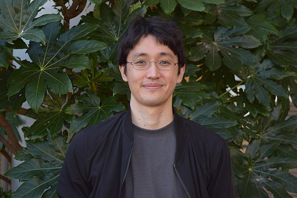

    
 

准教授 
富山大学学術研究部・医学系 
[システム情動科学講座](http://www.med.u-toyama.ac.jp/sysemosci/%e7%b4%b9%e4%bb%8b.html) 
〒930-0194　富山県富山市杉谷2630  
Email: jm  
[Researchmap](https://researchmap.jp/j_matsu) / 
[Google Schoalr](https://scholar.google.co.jp/citations?user=_d71FFcAAAAJ&hl=ja) / 
[GitHib](https://github.com/MatsumotoJ) / 
[X (twitter)](https://x.com/jumpeim_uot) 
所属学会: 日本神経科学会, 日本生理学会, 日本動物心理学会, 北米神経科学会 
(写真は2024年10月に撮影)

# 目次
[お知らせ](#お知らせ) / [研究の興味](#研究の興味) / [研究手法・研究環境](#研究手法・研究環境) / [経歴](#経歴) / [主な論文](#主な論文) / [公開リソース](#公開リソース)

# お知らせ

<u>大学院生、卒研生、学部学生、研究スタッフ、アルバイト等</u>を募集しています。

- 学生の方へ
    - 神経科学、動物行動学、情報工学、あるいはそれらの融合領域に関心を持ち、意欲的に取り組める方を歓迎します。専門的な知識や経験は問いません。興味があればぜひご連絡ください。
    - 大学院生は、創発的研究支援事業のRAでの経済的サポートが可能です：給与(〜２０万円/月)支給有り。
- 研究室内でのアルバイトもあります：機械学習用の教師データ作成支援など。
- 研究スタッフの募集は[こちら](https://www.u-toyama.ac.jp/wp/wp-content/uploads/employ_20250825-1.pdf)

# 研究の興味

私たち人間の脳の働きを理解し、さまざまな疾患における脳機能の異常を治療するには、実験動物を用いた詳しい研究が不可欠です。しかし、動物は人間と違って、自分の気持ちなどの内面の状態を言葉で伝えることができません。このことは、特に情動(感情)や社会性といった私たちの“心”に深く関わる脳の働きを研究する上で、長い間大きな壁になってきました。

私は、動物が自然な環境の中で見せる多様で“表情豊かな”行動に注目しています。こうした動物本来の行動をありのままに、かつ高精度に測定・解析する手法を開発し、それを応用して動物の内面を読み解くことで、情動や社会性に関わる脳の仕組みの理解を大きく前進させることを目指しています。

具体的には、これまでに、AI技術等を活用したサルやネズミ用のマーカーレス・モーションキャプチャー(下記動画1)や、音源定位法を用いた音声コミュニケーションの測定技術(動画2)などを開発してきました。現在は、これらの技術を統合・発展させるとともに、主に社会行動に関わる脳機能の研究への応用を進めています。

**動画1**: マーカーレス・モーションキャプチャーによるサル集団の社会行動解析 (Matsumoto et al., 2025, *Science Advances*): 
<iframe width="560" height="315"
src="https://www.youtube.com/embed/UC0WZiKxrj4"
frameborder="0" allowfullscreen></iframe>

**動画2**: 音源定位法によるネズミの超音波音声コミュニケーションの解析 (Matsumoto et al., 2022, *iScience*): 
<iframe width="560" height="315"
src="https://www.youtube.com/embed/w4XTPwqTDFI"
frameborder="0" allowfullscreen></iframe>

# 研究手法・研究環境

研究対象としている動物は、主にネズミ（マウス・ラット）とサル（マカクサル・マーモセット）です。独自に開発を進めている行動解析技術に加え、行動中の動物からニューロン活動を記録する電気生理学的手法においても豊富な実績があります。近年では、光遺伝学、化学遺伝学、光イメージングといった先進的な技術を導入し、神経回路レベルでの脳機能の解明に取り組んでいます。

富山大学では[アイドリング脳科学研究センター](http://www.sugitani.u-toyama.ac.jp/rcibs/index-j.html)を中心として、神経科学の様々な分野の研究者が集まっています。さらに、私たちは、国内(鹿児島大、九工大、名市大、京大、NCNP、東大など)および海外(ポーランド・Nencki研究所、ドイツ・テュービンゲン大、ドイツ・ミュンヘン大など)の研究機関と共同研究を行っています。また、学術変革領域([行動変容生物学](https://braidyn-bc.jp/))にも参画しています。このように、地方にありながらも、国内外の優れた研究者との交流や共同研究を通じて、日々多くの刺激を受けられる環境が整っています。

### 生活環境について

 
 ©（公社）とやま観光推進機構 

富山は、海と山に囲まれた自然豊かな地域で、広々とした暮らしやすい環境が特徴です。北陸新幹線により、都市圏へのアクセスも良いです。富山駅から京都駅までは約2時間半、東京駅へは約2時間で移動可能です。

# 経歴

- 2002-2006年: 東北大学 理学部 生物学科 卒業	
- 2006-2008年: 東北大学 工学研究科修士課程 電気通信工学専攻 修了
- 2008-2012年: 富山大学 生命融合科学教育部博士課程 認知情動脳科学専攻修了
- 2012-2025年: 富山大学 学術研究部・医学系 システム情動科学講座 助教 
- 2015-2017年: コレージュ・ド・フランス Brain Rhythms and Neural Coding of Memory, CIRB 客員研究員
- 2025年-現在: 富山大学 学術研究部・医学系 システム情動科学講座 准教授

# 主な論文

**Matsumoto J**, Kaneko T, Kimura K, Blanco Negrete S, Guo J, Suda-Hashimoto N, Kaneko A, Morimoto M, Nishimaru H, Setogawa T, Go Y, Shibata T, Nishijo H, Takada M, Inoue K (2025)Three-dimensional markerless motion capture of multiple freely behaving monkeys toward automated characterization of social behavior. *Science Advances* 11(26):eadn1355.

Mimura K, **Matsumoto J**, Mochihashi D, Nakamura T, Nishijo H, Higuchi M, Hirabayashi T, Minamimoto T (2024) Unsupervised decomposition of natural monkey behavior into a sequence of motion motifs. *Communications Biology* 7(1):1080.

Kaneko T, **Matsumoto J**, Lu W, Zhao X, Ueno-Nigh LR, Oishi T, Kimura K, Otsuka Y, Zheng A, Ikenaka K, Baba K, Mochizuki H, Nishijo H, Inoue K, Takada M (2024) Deciphering social traits and pathophysiological conditions from natural behaviors in common marmosets. *Current Biology* 34(13):2854-2867.e5.

**Matsumoto J**, Kanno K, Kato M, Nishimaru H, Setogawa T, Chinzorig C, Shibata T, Nishijo H (2022) Acoustic camera system for measuring ultrasound communication in mice. *iScience* 25(8):104812. 

Yoshida T, Yamagata A, Imai A, Kim J, Izumi H, Nakashima S, Shiroshima T, Maeda A, Iwasawa-Okamoto S, Azechi K, Osaka F, Saitoh T, Maenaka K, Shimada T, Fukata Y, Fukata M, **Matsumoto J**, Nishijo H, Takao K, Tanaka S, Okabe S, Tabuchi K, Uemura T, Mishina M, Mori H, Fukai S (2021) Canonical versus non-canonical transsynaptic signaling of neuroligin 3 tunes development of sociality in mice. *Nature Communication* 12(1):1848. 

Labuguen R, **Matsumoto J**, Negrete SB, Nishimaru H, Nishijo H, Takada M, Go Y, Inoue KI, Shibata T (2021) MacaquePose: A Novel "In the Wild" Macaque Monkey Pose Dataset for Markerless Motion Capture. *Frontiers in Behavioral Neuroscience* 14:581154. 

Nakamura T, **Matsumoto J**, Nishimaru H, Bretas RV, Takamura Y, Hori E, Ono T, Nishijo H (2016) A Markerless 3D Computerized Motion Capture System Incorporating a Skeleton Model for Monkeys. *PLoS One* 11(11):e0166154. 

**Matsumoto J**, Nishimaru H, Takamura Y, Urakawa S, Ono T, Nishijo H (2016) Amygdalar Auditory Neurons Contribute to Self-Other Distinction during Ultrasonic Social Vocalization in Rats. *Frontiers in Neuroscience* 10:399. 

Fuzzo F, **Matsumoto J**, Kiyokawa Y, Takeuchi Y, Ono T, Nishijo H (2015) Social buffering suppresses fear-associated activation of the lateral amygdala in male rats: behavioral and neurophysiological evidence. *Frontiers in Neuroscience*  9:99. 

**Matsumoto J**, Urakawa S, Takamura Y, Malcher-Lopes R, Hori E, Tomaz C, Ono T, Nishijo H (2013) A 3D-video-based computerized analysis of social and sexual interactions in rats. *PLoS One* 8(10):e78460. 

**Matsumoto J**, Urakawa S, Hori E, de Araujo MF, Sakuma Y, Ono T, Nishijo H (2012) Neuronal responses in the nucleus accumbens shell during sexual behavior in male rats. *Journal of Neuroscience* 32(5):1672-86. 

全論文リスト: [Research map](https://researchmap.jp/j_matsu) / [Google schoalr](https://scholar.google.co.jp/citations?user=_d71FFcAAAAJ&hl=ja) 

# 公開リソース

- [MacaquePose](https://www.pri.kyoto-u.ac.jp/datasets/macaquepose/index.html): マカクサル姿勢の大規模教師データセット 
- サル用3Dマーカーレスモーションキャプチャーシステム ([マカクサル用](https://github.com/PrimatoModelling/macaque3Dpose), [マーモセット用](https://github.com/PrimatoModelling/marmo3Dpose)) 
- [USVCAM](https://github.com/MatsumotoJ/usvcam): ネズミの超音波発声の音源可視化システム 
- [Tetroplater](https://github.com/MatsumotoJ/Tetroplater): 電気生理実験用テトロード電極金メッキ装置 
- [3DTracker](http://3dtracker.org/): デプスセンサによるネズミ用マーカーレスモーションキャプチャーシステム 

その他は、[GitHubプロフィール](https://github.com/MatsumotoJ)を参照
