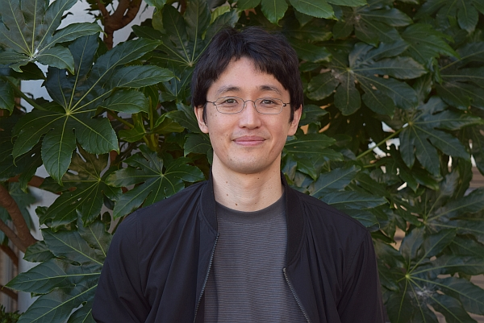

[Japanese](./index.md)/English
Jumpei Matsumoto Ph.D. (Medicine)

Associate Professor  
University of Toyama, Faculty of Medicine  
[Department of System Emotional Science](http://www.med.u-toyama.ac.jp/sysemosci/%e7%b4%b9%e4%bb%8b.html)  
2630 Sugitani, Toyama, 930-0194, Japan  
Email: jm  
[Researchmap](https://researchmap.jp/j_matsu?lang=en) / 
[Google Scholar](https://scholar.google.co.jp/citations?user=_d71FFcAAAAJ&hl=en) / 
[GitHub](https://github.com/MatsumotoJ) / 
[X (Twitter)](https://x.com/jumpeim_uot)  
Affiliated academic societies: Japan Neuroscience Society, Japanese Physiological Society, Japanese Society for Animal Psychology, Society for Neuroscience (USA)  
*(Photo taken in October 2024)*

## Contents
[News](#news) / [Research Interests](#research-interests) / [Technology and Environment](#technology-and-environment) / [Research History](#research-history) / [Publications](#publications) / [Resources](#resources)

---

# News

We are recruiting <u>graduate students, undergraduate research students, pre-research students, research staff, and part-time assistants</u>.

- For students:  
  We welcome motivated individuals interested in neuroscience, animal behavior, information technology, and/or the integration of these fields. Prior expertise is not required — enthusiasm and curiosity are key. Feel free to contact us if you are interested.  
  Graduate students can receive financial support as research assistants (RAs) through funding programs, including the *Fusion Oriented REsearch for disruptive Science and Technoloy (FOREST)* program, with salaries of up to 200,000 yen/month.
- Part-time positions are also available for tasks such as creating training datasets for machine learning.  
- Research staff recruitment details: [See here](https://www.u-toyama.ac.jp/wp/wp-content/uploads/employ_20250825-1.pdf)

---

# Research Interests

To understand the human brain functions and develop     treatments for neurological and psychiatric disorders, detailed studies using animal models are essential. However, unlike humans, animals cannot verbally express their internal states — a major challenge, especially when studying brain functions related to emotion and sociality.

I am focusing on the rich repertoire of natural behaviors in animals. These seem to reflect the animals' internal states well. By developing methods to measure and analyze these behaviors, I aim to decipher internal states of animals and uncover the neural mechanisms underlying emotion and social interactions.

Specifically, I have developed AI-based markerless motion capture systems for monkeys and rodents (Video 1) and sound localization systems for analyzing ultrasonic communication in rodents (Video 2). Currently, I am advancing and integrating these technologies to study brain mechanisms underlying social behavior.

<iframe width="560" height="315"
src="https://www.youtube.com/embed/UC0WZiKxrj4"
frameborder="0" allowfullscreen></iframe><b>Video 1:</b> Markerless motion capture for social behavior analysis in monkeys (*Matsumoto et al., 2025, Science Advances*)    
<iframe width="560" height="315"
src="https://www.youtube.com/embed/w4XTPwqTDFI"
frameborder="0" allowfullscreen></iframe><b>Video 2:</b> Acoustic camera system for ultrasonic vocal communication in mice (*Matsumoto et al., 2022, iScience*) 

---

# Technology and Environment

Our research primarily uses rats, mice, and non-human primates (macaques and marmosets). In addition to developing  behavior analysis methods, our lab has extensive experience in electrophysiological recording during behavior. We also employ advanced techniques such as optogenetics, chemogenetics, and optical imaging to analyze brain function at the circuit level.

At the University of Toyama, researchers in diverse areas of neuroscience gather at the [Research Center for Idling Brain Science (RCIBS)](http://www.sugitani.u-toyama.ac.jp/rcibs/). 
We also collaborate with domestic (Kagoshima Univ., Kyushu Inst. of Tech., Nagoya City Univ., Kyoto Univ., NCNP, Univ. of Tokyo, etc.) and international partners (Nencki Institute, Univ. of Tübingen, LMU Munich, etc.). Our lab is also part of the [Biology of Behavioral Change (BRAIDYN)](https://braidyn-bc.jp/) research area. Thus, even in a regional setting, our environment offers rich opportunities for collaboration and intellectual exchange with leading researchers.

### Living Environment

 
©（公社）とやま観光推進機構 
Toyama is a region rich in nature, surrounded by the sea and mountains, characterized by its spacious and comfortable living environment. Thanks to the Hokuriku Shinkansen, access to major cities is convenient — about 2.5 hours to Kyoto and 2 hours to Tokyo from Toyama Station.

---

# Research History

- 2002–2006: B.Sc. in Biology, Tohoku University  
- 2006–2008: M.Sc. in Electrical and Communication Engineering, Tohoku University  
- 2008–2012: Ph.D. in Cognitive and Emotional Neuroscience, University of Toyama  
- 2012–2025: Assistant Professor, Dept. of System Emotional Science, Univ. of Toyama  
- 2015–2017: Visiting Researcher, *Brain Rhythms and Neural Coding of Memory* Laboratory, CIRB, Collège de France  
- 2025–present: Associate Professor, Dept. of System Emotional Science, Univ. of Toyama

---

# Publications

**Matsumoto J**, Kaneko T, Kimura K, Blanco Negrete S, Guo J, Suda-Hashimoto N, Kaneko A, Morimoto M, Nishimaru H, Setogawa T, Go Y, Shibata T, Nishijo H, Takada M, Inoue K (2025) Three-dimensional markerless motion capture of multiple freely behaving monkeys toward automated characterization of social behavior. *Science Advances* 11(26):eadn1355.

Mimura K, **Matsumoto J**, Mochihashi D, Nakamura T, Nishijo H, Higuchi M, Hirabayashi T, Minamimoto T (2024) Unsupervised decomposition of natural monkey behavior into a sequence of motion motifs. *Communications Biology* 7(1):1080.

Kaneko T, **Matsumoto J**, Lu W, Zhao X, Ueno-Nigh LR, Oishi T, Kimura K, Otsuka Y, Zheng A, Ikenaka K, Baba K, Mochizuki H, Nishijo H, Inoue K, Takada M (2024) Deciphering social traits and pathophysiological conditions from natural behaviors in common marmosets. *Current Biology* 34(13):2854-2867.e5.

**Matsumoto J**, Kanno K, Kato M, Nishimaru H, Setogawa T, Chinzorig C, Shibata T, Nishijo H (2022) Acoustic camera system for measuring ultrasound communication in mice. *iScience* 25(8):104812. 

Yoshida T, Yamagata A, Imai A, Kim J, Izumi H, Nakashima S, Shiroshima T, Maeda A, Iwasawa-Okamoto S, Azechi K, Osaka F, Saitoh T, Maenaka K, Shimada T, Fukata Y, Fukata M, **Matsumoto J**, Nishijo H, Takao K, Tanaka S, Okabe S, Tabuchi K, Uemura T, Mishina M, Mori H, Fukai S (2021) Canonical versus non-canonical transsynaptic signaling of neuroligin 3 tunes development of sociality in mice. *Nature Communication* 12(1):1848. 

Labuguen R, **Matsumoto J**, Negrete SB, Nishimaru H, Nishijo H, Takada M, Go Y, Inoue KI, Shibata T (2021) MacaquePose: A Novel "In the Wild" Macaque Monkey Pose Dataset for Markerless Motion Capture. *Frontiers in Behavioral Neuroscience* 14:581154. 

Nakamura T, **Matsumoto J**, Nishimaru H, Bretas RV, Takamura Y, Hori E, Ono T, Nishijo H (2016) A Markerless 3D Computerized Motion Capture System Incorporating a Skeleton Model for Monkeys. *PLoS One* 11(11):e0166154. 

**Matsumoto J**, Nishimaru H, Takamura Y, Urakawa S, Ono T, Nishijo H (2016) Amygdalar Auditory Neurons Contribute to Self-Other Distinction during Ultrasonic Social Vocalization in Rats. *Frontiers in Neuroscience* 10:399. 

Fuzzo F, **Matsumoto J**, Kiyokawa Y, Takeuchi Y, Ono T, Nishijo H (2015) Social buffering suppresses fear-associated activation of the lateral amygdala in male rats: behavioral and neurophysiological evidence. *Frontiers in Neuroscience*  9:99. 

**Matsumoto J**, Urakawa S, Takamura Y, Malcher-Lopes R, Hori E, Tomaz C, Ono T, Nishijo H (2013) A 3D-video-based computerized analysis of social and sexual interactions in rats. *PLoS One* 8(10):e78460. 

**Matsumoto J**, Urakawa S, Hori E, de Araujo MF, Sakuma Y, Ono T, Nishijo H (2012) Neuronal responses in the nucleus accumbens shell during sexual behavior in male rats. *Journal of Neuroscience* 32(5):1672-86. 

…and more on [Researchmap](https://researchmap.jp/j_matsu?lang=en) or [Google Scholar](https://scholar.google.co.jp/citations?user=_d71FFcAAAAJ&hl=en)

---

# Resources

- [MacaquePose](https://www.pri.kyoto-u.ac.jp/datasets/macaquepose/index.html): Large-scale macaque pose dataset  
- 3D markerless motion capture systems for primates ([macaques](https://github.com/PrimatoModelling/macaque3Dpose), [marmosets](https://github.com/PrimatoModelling/marmo3Dpose))  
- [USVCAM](https://github.com/MatsumotoJ/usvcam): Acoustic camera system for ultrasonic vocalizations in rodents  
- [Tetroplater](https://github.com/MatsumotoJ/Tetroplater): Open-source circuit for microwire tetrode gold plating for electrophysiology
- [3DTracker](http://3dtracker.org/): Markerless motion capture for rodents using depth sensors  

See also my [GitHub profile](https://github.com/MatsumotoJ) for additional tools and resources.
